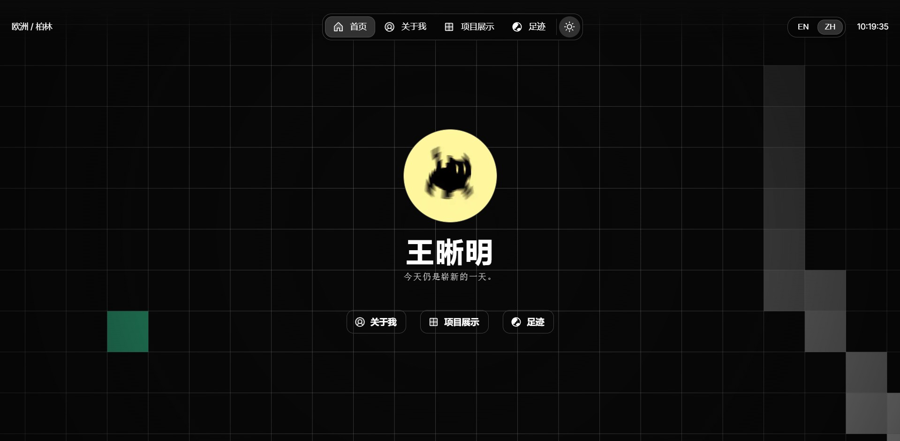

# 🚀 Ximing's Digital Garden | 个人主页

  
  

    <a href="https://ximingcn.com"><strong>🌐 访问预览 (Live Demo)</strong></a>
  

  
  
  
  

---

## ✨ 核心特性 (Key Features)

- 🌍 **Full i18n Support**: 基于 `next-intl` 实现全站中英双语无缝切换。
- 📍 **Travel Globe**: 基于 Mapbox 的 3D 差旅轨迹球，记录我的飞行与足迹。
- 📱 **Mobile Optimized**: 深度定制的移动端折叠菜单与 UI 适配，符合人体工学的交互设计。
- 🌓 **Theme Switcher**: 丝滑的深色/浅色模式切换。

## 🛠️ 技术栈 (Tech Stack)

- **Framework**: [Next.js 15 (App Router)](https://nextjs.org/)
- **UI Architecture**: [Once UI](https://once-ui.com/)
- **Language**: TypeScript
- **Internationalization**: `next-intl`
- **Map**: Mapbox GL
